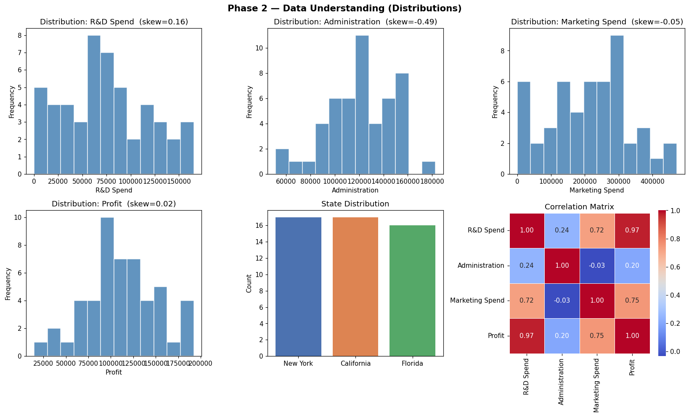
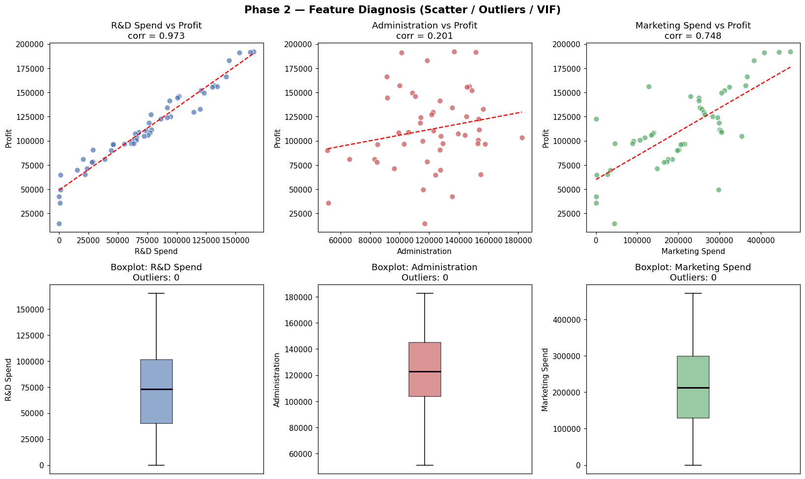
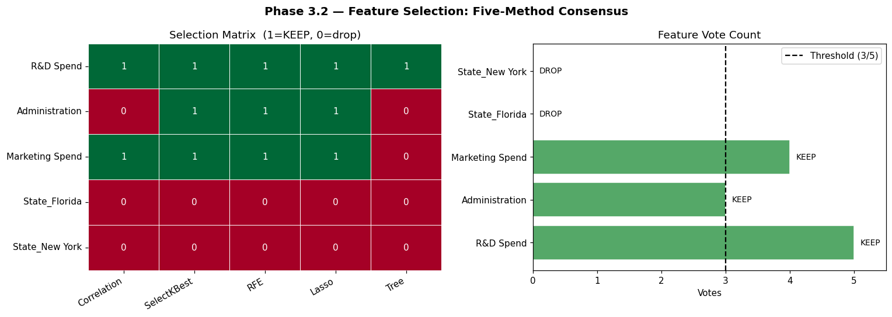
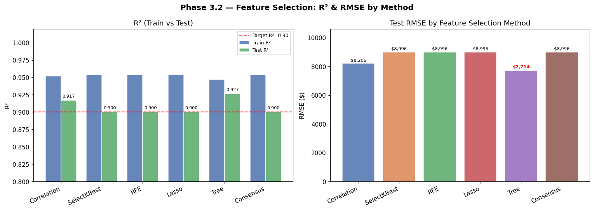
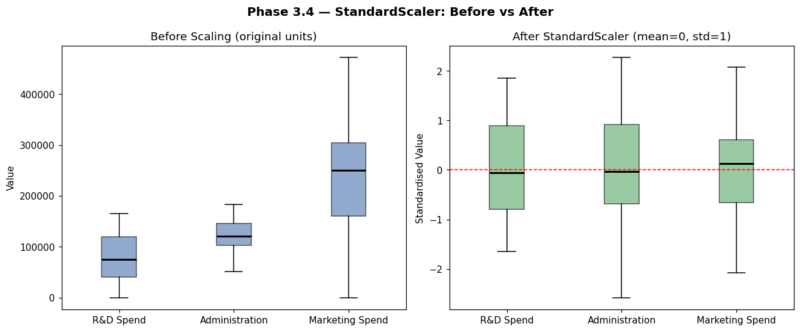

# 50 Startups — Multiple Linear Regression (CRISP-DM)

[](https://startup-profit-predictor.streamlit.app/)

A complete machine learning pipeline predicting startup profit from R&D, Administration, and Marketing spending, following the **CRISP-DM** (Cross Industry Standard Process for Data Mining) six-phase methodology.

> **[Live Demo →](https://startup-profit-predictor.streamlit.app/)** Interactive app with 10-method feature selection comparison, real-time profit prediction simulator, and full model evaluation dashboard.

---

## Project Poster


---

## Table of Contents

1. [Project Overview](#project-overview)
2. [Dataset](#dataset)
3. [CRISP-DM Phases](#crisp-dm-phases)
   - [Phase 1 – Business Understanding](#phase-1--business-understanding)
   - [Phase 2 – Data Understanding](#phase-2--data-understanding)
   - [Phase 3 – Data Preparation](#phase-3--data-preparation)
   - [Phase 4 – Modeling](#phase-4--modeling)
   - [Phase 5 – Evaluation](#phase-5--evaluation)
   - [Phase 6 – Deployment](#phase-6--deployment)
4. [Key Results](#key-results)
5. [Repository Structure](#repository-structure)
6. [Requirements](#requirements)

---

## Project Overview

**Goal:** Build a regression model to predict the annual profit of 50 startups, enabling investors to make better capital-allocation decisions.

**Target variable:** `Profit` (continuous, USD)  
**Task type:** Supervised regression  
**Algorithm:** Multiple Linear Regression  
**Business success criterion:** Test R² ≥ 0.90

---

## Dataset

| Property | Value |
|----------|-------|
| File | `50_Startups.csv` |
| Rows | 50 |
| Columns | 5 |
| Missing values | None |
| Source | Classic ML teaching dataset |

### Features

| Column | Type | Description |
|--------|------|-------------|
| `R&D Spend` | Numeric | Research & development expenditure (USD) |
| `Administration` | Numeric | Administrative overhead cost (USD) |
| `Marketing Spend` | Numeric | Marketing & sales expenditure (USD) |
| `State` | Categorical | Company location: New York / California / Florida |
| `Profit` | Numeric | **Target** — annual profit (USD) |

---

## CRISP-DM Phases

---

### Phase 1 – Business Understanding

**Objective:** Understand the business problem before touching any data.

- **Problem type:** Predict startup profit → supervised regression
- **Stakeholders:** Investors, portfolio managers
- **Business goal:** Identify which spending categories most influence profit to guide resource allocation
- **Success metric:** R² ≥ 0.90 on held-out test set (unseen data)

**Business question:**  
*"Given a startup's spending profile and location, how much profit should we expect?"*

---

### Phase 2 – Data Understanding

Six diagnostic checks were performed to identify data quality issues and inform preparation decisions.

#### 2.1 Zero Values

| Feature | Zeros | Interpretation |
|---------|-------|----------------|
| R&D Spend | 2 | Valid — some startups invest nothing in R&D |
| Marketing Spend | 3 | Valid — some startups run zero paid marketing |
| Administration | 0 | No zeros |
| Profit | 0 | No zeros |

**Decision:** No imputation needed. Zeros represent genuine business states.

#### 2.2 Skewness Analysis

All numeric features fall within the acceptable range (|skew| < 0.5), so **no log transformation is required**.

| Feature | Skewness | Status |
|---------|----------|--------|
| R&D Spend | +0.164 | OK |
| Administration | −0.489 | OK |
| Marketing Spend | −0.046 | OK |
| Profit | +0.023 | OK |

#### 2.3 Outlier Detection (IQR × 1.5)

| Feature | Outliers | Bounds |
|---------|----------|--------|
| R&D Spend | 0 | [−52,563 ; 194,102] |
| Administration | 0 | [42,064 ; 206,509] |
| Marketing Spend | 0 | [−125,953 ; 554,723] |
| Profit (target) | 1 | [15,698 ; 214,207] |

**Decision:** One borderline outlier in the target variable only — no feature outliers. No removal necessary.

#### 2.4 Feature Scale (Motivation for Scaling)

The three numeric predictors have vastly different standard deviations, making raw coefficient comparison meaningless and biasing any regularized model.

| Feature | Min | Max | Std |
|---------|-----|-----|-----|
| R&D Spend | 0 | 165,349 | 45,902 |
| Administration | 51,283 | 182,646 | 28,018 |
| Marketing Spend | 0 | 471,784 | 122,290 |

**Decision:** `StandardScaler` required for all numeric features before modeling.

#### 2.5 Multicollinearity (VIF)

Variance Inflation Factor (VIF) measures how much each feature's variance is inflated by collinearity with others. VIF > 5 indicates a problem.

| Feature | VIF | Status |
|---------|-----|--------|
| R&D Spend | 2.47 | OK |
| Administration | 1.18 | OK |
| Marketing Spend | 2.33 | OK |

**Decision:** No multicollinearity concern. All features are safe to use together.

#### 2.6 Profit Correlation & OLS p-values

A statsmodels OLS regression on the full feature set provides individual significance tests.

| Feature | Correlation with Profit | p-value | Signal |
|---------|------------------------|---------|--------|
| R&D Spend | **0.9729** | 0.0000 | Very strong |
| Marketing Spend | 0.7478 | 0.1227 | Moderate |
| Administration | 0.2007 | 0.6077 | Weak |
| State_Florida | — | 0.9532 | Negligible |
| State_New York | — | 0.9898 | Negligible |

**Phase 2 Summary of Actions Required:**

| Feature | Action |
|---------|--------|
| State | One-Hot Encoding |
| R&D Spend, Marketing Spend | StandardScaler |
| Administration | Flag for feature selection (low correlation, high p-value) |
| State dummies | Flag for feature selection (negligible correlation) |

**Outputs:**  
  
*Fig 2a – Feature distributions, skewness, and correlation heatmap*

  
*Fig 2b – Scatter plots vs Profit and boxplots for outlier detection*

---

### Phase 3 – Data Preparation

Four sequential steps transform the raw data into a model-ready dataset.

#### 3.1 One-Hot Encoding

`State` (3 categories) is converted to two binary dummy variables using `pd.get_dummies(drop_first=True)` to avoid the dummy variable trap (perfect multicollinearity).

| Original | Encoded |
|----------|---------|
| California | State_Florida=0, State_New York=0 (reference) |
| Florida | State_Florida=1, State_New York=0 |
| New York | State_Florida=0, State_New York=1 |

After encoding the feature set has 5 candidates:  
`R&D Spend`, `Administration`, `Marketing Spend`, `State_Florida`, `State_New York`

---

#### 3.2 Feature Selection — Five Methods

Five independent feature selection methods are applied to the same dataset, then a **majority vote (≥ 3/5)** determines the final feature set.

##### Method 1 — Correlation Filter (|r| ≥ 0.30)

Features with absolute Pearson correlation below 0.30 are too weakly related to Profit to be useful.

| Feature | |r| | Selected |
|---------|----|----------|
| R&D Spend | 0.9729 | ✅ |
| Marketing Spend | 0.7478 | ✅ |
| Administration | 0.2007 | ❌ |
| State_Florida | 0.1162 | ❌ |
| State_New York | 0.0314 | ❌ |

##### Method 2 — SelectKBest with F-regression (k=3)

The F-statistic measures how much variance in Profit is explained by each feature individually. Top 3 selected.

| Feature | F-score | Selected |
|---------|---------|----------|
| R&D Spend | **849.79** | ✅ |
| Marketing Spend | 60.88 | ✅ |
| Administration | 2.02 | ✅ |
| State_Florida | 0.66 | ❌ |
| State_New York | 0.05 | ❌ |

##### Method 3 — Recursive Feature Elimination (RFE, k=3)

RFE iteratively removes the least important feature (by coefficient magnitude on standardized data) until k=3 remain.

| Feature | Rank | Selected |
|---------|------|----------|
| R&D Spend | 1 | ✅ |
| Administration | 1 | ✅ |
| Marketing Spend | 1 | ✅ |
| State_Florida | 2 | ❌ |
| State_New York | 3 | ❌ |

##### Method 4 — Lasso Regularization (LassoCV, best α = 388.20)

L1 regularization shrinks unimportant coefficients exactly to zero. Applied on scaled features. LassoCV finds optimal α via 5-fold cross-validation.

| Feature | Coefficient | Selected |
|---------|-------------|----------|
| R&D Spend | +36,106.85 | ✅ |
| Marketing Spend | +3,290.64 | ✅ |
| Administration | −233.51 | ✅ |
| State_Florida | 0.0000 | ❌ |
| State_New York | 0.0000 | ❌ |

##### Method 5 — Tree-based Importance (RandomForest, n=200)

Random Forest splits data on the most informative features. Importance ≥ mean importance is the selection threshold.

| Feature | Importance | Selected |
|---------|------------|----------|
| R&D Spend | **0.9315** | ✅ |
| Marketing Spend | 0.0573 | ❌ |
| Administration | 0.0082 | ❌ |
| State_Florida | 0.0015 | ❌ |
| State_New York | 0.0015 | ❌ |

##### Consensus Summary

| Feature | Corr | SelectKBest | RFE | Lasso | Tree | **Votes** | **Decision** |
|---------|:----:|:-----------:|:---:|:-----:|:----:|:---------:|:------------:|
| R&D Spend | ✅ | ✅ | ✅ | ✅ | ✅ | **5/5** | **KEEP** |
| Marketing Spend | ✅ | ✅ | ✅ | ✅ | ❌ | **4/5** | **KEEP** |
| Administration | ❌ | ✅ | ✅ | ✅ | ❌ | **3/5** | **KEEP** |
| State_Florida | ❌ | ❌ | ❌ | ❌ | ❌ | **0/5** | **DROP** |
| State_New York | ❌ | ❌ | ❌ | ❌ | ❌ | **0/5** | **DROP** |

**Final features selected: `R&D Spend`, `Marketing Spend`, `Administration`**  
State dummy variables are unanimously removed by all five methods.

##### Performance by Feature Selection Method

Each method's feature subset is evaluated independently with a LinearRegression on the same 80/20 split:

| Method | Features | Test R² | Test RMSE |
|--------|----------|:-------:|:---------:|
| Correlation | R&D + Marketing | 0.9168 | $8,206 |
| SelectKBest | R&D + Admin + Marketing | 0.9001 | $8,996 |
| RFE | R&D + Admin + Marketing | 0.9001 | $8,996 |
| Lasso | R&D + Admin + Marketing | 0.9001 | $8,996 |
| **Tree** | **R&D only** | **0.9265** | **$7,714** |
| Consensus | R&D + Admin + Marketing | 0.9001 | $8,996 |

> **Notable finding:** The Tree method (R&D Spend only) achieves the lowest RMSE and highest R², showing that R&D is by far the dominant predictor and a single-feature model can be competitive on this small dataset.

  
*Fig 3a – Selection matrix heatmap and vote bar chart*

  
*Fig 3c – R² (Train vs Test) and Test RMSE across all six feature sets*

---

#### 3.3 Train / Test Split

| Set | Samples | Proportion |
|-----|---------|------------|
| Training | 40 | 80% |
| Test | 10 | 20% |
| `random_state` | 42 | Reproducible |

---

#### 3.4 StandardScaler

`StandardScaler` is fitted **only on the training set** (to prevent data leakage) and applied to both train and test sets via a `ColumnTransformer`:

- **Numeric features** (`R&D Spend`, `Administration`, `Marketing Spend`): transformed to mean ≈ 0, std ≈ 1
- **Dummy features**: passed through unchanged (scaling 0/1 variables is not meaningful)

| Feature | Mean before | Std before | Mean after | Std after |
|---------|------------|------------|-----------|-----------|
| R&D Spend | 77,688 | 47,898 | 0.000 | 1.013 |
| Administration | 121,143 | 27,454 | 0.000 | 1.013 |
| Marketing Spend | 235,747 | 114,864 | 0.000 | 1.013 |

  
*Fig 3b – Boxplots before and after StandardScaler*

---

#### 3.5 Pipeline

A `sklearn.pipeline.Pipeline` bundles preprocessing and modeling into a single object, ensuring the scaler is always fitted on training data only during cross-validation and final evaluation:

```python
Pipeline([
    ("preprocessor", ColumnTransformer([
        ("scaler",      StandardScaler(), numeric_features),
        ("passthrough", "passthrough",    dummy_features),
    ])),
    ("model", LinearRegression()),
])
```

---

### Phase 4 – Modeling

**Algorithm:** Ordinary Least Squares (OLS) Linear Regression  
`sklearn.linear_model.LinearRegression`

The pipeline is fitted on the 40-sample training set. Coefficients are on **standardized features**, so their magnitudes are directly comparable.

| Feature | Standardized Coefficient | Interpretation |
|---------|:------------------------:|----------------|
| R&D Spend | **+38,014.74** | Strongest positive driver of profit |
| Marketing Spend | +3,543.39 | Secondary positive effect |
| Administration | −1,841.48 | Minor negative effect (overhead drag) |
| Intercept | 115,651.72 | Baseline profit |

**Model equation (on standardized inputs):**

```
Profit = 115,651.72
       + 38,014.74 × (R&D_scaled)
       +  3,543.39 × (Marketing_scaled)
       −  1,841.48 × (Admin_scaled)
```

---

### Phase 5 – Evaluation

Three evaluation strategies are used: train/test split, and 5-fold cross-validation.

#### Train / Test Performance

| Metric | Train | Test |
|--------|:-----:|:----:|
| **R²** | 0.9536 | **0.9001** |
| **MAE** | $6,597 | $6,979 |
| **RMSE** | $8,938 | $8,996 |
| **MAPE** | 10.92% | 10.32% |

- Test R² = **0.9001** meets the business target (≥ 0.90)
- Small train/test gap indicates no significant overfitting
- Average prediction error is approximately **$7,000** on profits ranging from $14K to $192K

#### 5-Fold Cross-Validation

| Fold | R² |
|------|----|
| Fold 1 | 0.8931 |
| Fold 2 | −0.8112 |
| Fold 3 | −0.4193 |
| Fold 4 | −0.7012 |
| Fold 5 | 0.4304 |
| **Mean ± Std** | **−0.12 ± 0.67** |

> **Important note on CV instability:** With only 50 samples, each CV fold trains on ~32 samples and tests on ~8. Some test folds happen to contain only high-profit or only low-profit companies, causing extreme negative R² scores. This is a **small-sample limitation**, not a model failure. The single held-out test set (random_state=42, 10 representative samples) is a more reliable metric for this dataset size.

  
*Fig 5 – Actual vs Predicted, Residual plots, Feature Coefficients, CV scores*

---

### Phase 6 – Deployment

The fitted pipeline can predict profit for any new startup by providing the three input features. No manual scaling is needed — the pipeline handles it internally.

#### Sample Predictions

| Company | R&D Spend | Administration | Marketing Spend | Predicted Profit |
|---------|----------:|---------------:|----------------:|----------------:|
| Company 1 | $150,000 | $120,000 | $300,000 | **$175,860** |
| Company 2 | $50,000 | $100,000 | $100,000 | **$90,592** |
| Company 3 | $0 | $80,000 | $50,000 | **$50,200** |

#### Usage

```python
import pandas as pd

new_startup = pd.DataFrame({
    "R&D Spend":       [80000],
    "Administration":  [110000],
    "Marketing Spend": [200000],
})

predicted_profit = pipeline.predict(new_startup)
print(f"Predicted Profit: ${predicted_profit[0]:,.2f}")
```

---

## Key Results

| Finding | Detail |
|---------|--------|
| **Best single predictor** | R&D Spend (r = 0.97, RF importance = 0.93) |
| **State effect** | Negligible — dropped by all 5 feature selection methods |
| **Administration** | Borderline (3/5 vote to keep); negative coefficient suggests overhead drag |
| **Final model R²** | 0.9001 on test set |
| **Deployment** | sklearn Pipeline — scaler + model in one object, no leakage risk |

**Business recommendation:** Prioritize R&D investment. A $10,000 increase in R&D spend is associated with approximately **$8,000 additional profit** (based on unstandardized OLS).

---

## Repository Structure

```
50_Startups/
├── 50_Startups.csv                  # Raw dataset (50 rows × 5 columns)
├── 50_startups_crisp_dm.py          # Full CRISP-DM pipeline script
├── phase2a_distributions.png        # Feature distributions + correlation heatmap
├── phase2b_diagnosis.png            # Scatter plots + boxplot outlier check
├── phase3a_feature_selection.png    # 5-method feature selection matrix + votes
├── phase3b_scaling.png              # StandardScaler before/after comparison
├── phase3c_performance.png          # R² and RMSE by feature selection method
├── phase5_evaluation.png            # Actual vs Predicted + Residuals + CV scores
└── README.md                        # This file
```

---

## Requirements

```
pandas
numpy
matplotlib
seaborn
scikit-learn
statsmodels
```

Install all dependencies:

```bash
pip install pandas numpy matplotlib seaborn scikit-learn statsmodels
```

Run the full pipeline:

```bash
python 50_startups_crisp_dm.py
```

---

*CRISP-DM implementation · sklearn Pipeline · 5-method Feature Selection · Multiple Linear Regression*
