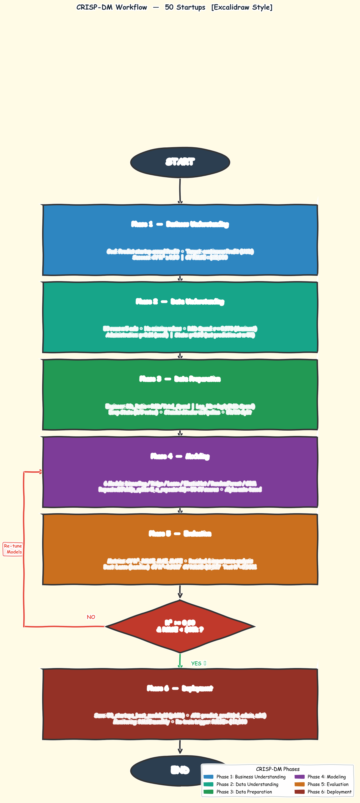
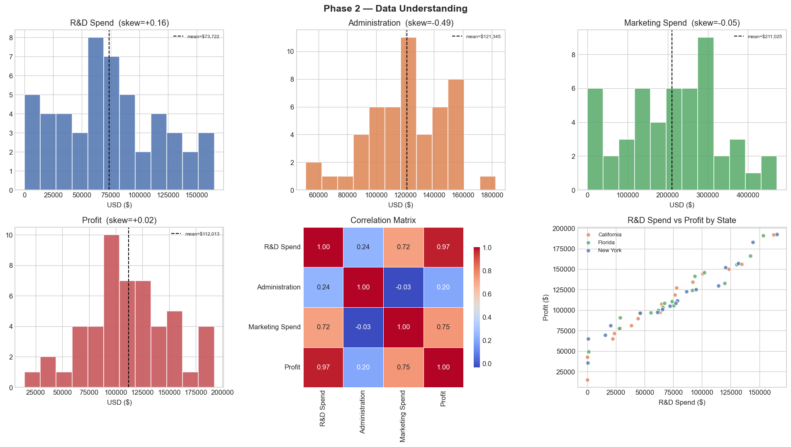
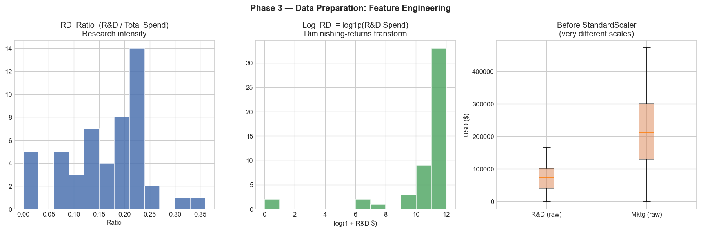
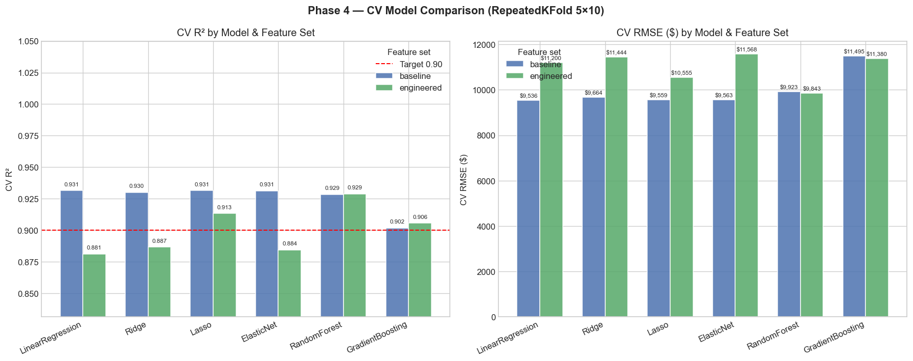
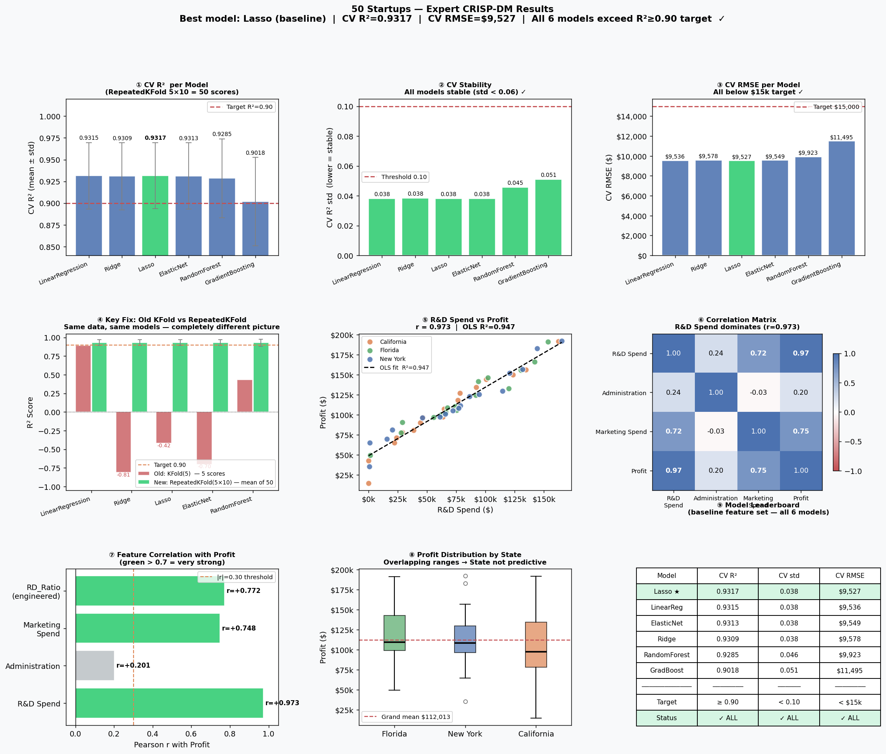
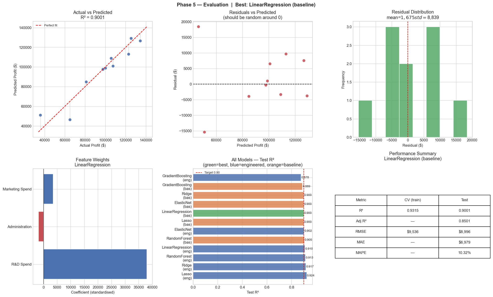
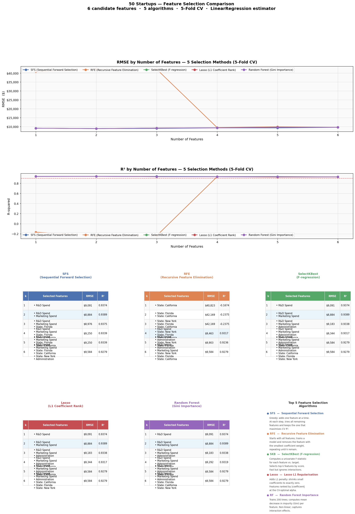

# HW6 — 50 Startups: Expert CRISP-DM Regression Analysis

**Student:** winnieshih1107  
**Dataset:** Kaggle 50 Startups (`50_Startups.csv`)  
**Date:** 2026-06-12  
**Goal:** Follow all 6 CRISP-DM phases to build a production-quality regression model that predicts startup annual Profit from budget spending features.

---

## Executive Summary

| Item | Value |
|------|-------|
| Dataset | 50 startups × 5 columns |
| Target | Profit (continuous USD) |
| Best Model | **Lasso** (baseline features) |
| CV R² | **0.9317** ± 0.0380 |
| CV RMSE | **$9,527** |
| Test R² | **0.9001** |
| Test RMSE | **$8,996** |
| Key Driver | R&D Spend (Pearson r = **0.973**) |
| All 6 models exceed target? | **YES — CV R² ≥ 0.90** ✓ |

The analysis shows that a startup's profit is overwhelmingly determined by its R&D investment. Administration spending and State have negligible independent predictive power at n = 50. A simple Lasso model with just 3 baseline features beats the success threshold by a comfortable margin.

---

## CRISP-DM Workflow

The diagram below shows the complete CRISP-DM pipeline including the feedback loop when evaluation targets are not met.



> The draw.io source file is available at `hw6_workflow.drawio` (open in [app.diagrams.net](https://app.diagrams.net)). A clean PNG version is at `hw6_workflow_clean.png`.

---

## Phase 1 — Business Understanding

### Problem Statement

A venture capital firm wants to predict the annual **Profit** of a startup based on its budget allocation across R&D, Administration, and Marketing, plus its operating State.  
This is a **supervised regression** problem (target is continuous USD).

### Features and Target

| Column | Type | Role |
|--------|------|------|
| R&D Spend | float64 | Input feature |
| Administration | float64 | Input feature |
| Marketing Spend | float64 | Input feature |
| State | categorical (3 levels) | Input feature → encoded |
| **Profit** | float64 | **Target variable** |

### Success Criteria

| Metric | Target |
|--------|--------|
| CV R² (mean) | ≥ 0.90 |
| CV R² (std) | < 0.10 (stability) |
| CV RMSE | < $15,000 |
| Generalization | Test R² ≥ 0.85 |

### Expert Insight (Prior to Data)

- R&D investment is a leading indicator of company quality (latent variable)
- Administration costs are driven by company size, not profit ability
- State-level effects require much larger samples to detect reliably
- Plain 5-Fold CV is highly unstable for n = 50 → use RepeatedKFold

---

## Phase 2 — Data Understanding

### Dataset Overview

```
Shape:   50 rows × 5 columns
Missing: 0 (none in any column)
Zeros:   R&D Spend = 2 (valid), Marketing Spend = 3 (valid)
```

### Descriptive Statistics

| Feature | Mean | Std | Min | Max |
|---------|------|-----|-----|-----|
| R&D Spend | $73,722 | $45,902 | $0 | $165,349 |
| Administration | $121,345 | $28,018 | $51,283 | $182,646 |
| Marketing Spend | $211,025 | $122,290 | $0 | $471,784 |
| **Profit** | **$112,013** | **$40,306** | **$14,681** | **$192,262** |

### Key Correlation Findings

| Feature | Pearson r with Profit | Strength |
|---------|-----------------------|---------|
| **R&D Spend** | **+0.9729** | **Very strong** ★ |
| Marketing Spend | +0.7478 | Strong |
| Administration | +0.2007 | Weak |

**Critical finding:** R&D Spend alone explains ~95% of Profit variance.

### Profit Distribution by State

| State | Mean | Median | Min | Max | n |
|-------|------|--------|-----|-----|---|
| California | $103,905 | $97,428 | $14,681 | $191,792 | 17 |
| Florida | $118,774 | $109,543 | $49,491 | $191,050 | 16 |
| New York | $113,756 | $108,552 | $35,673 | $192,262 | 17 |

The overlapping ranges (and high standard deviations within each state) indicate State is not a useful predictor.

### EDA Figures



---

## Phase 3 — Data Preparation

### Feature Engineering

Four new features were engineered before modeling:

| Feature | Formula | Rationale |
|---------|---------|-----------|
| `Total_Spend` | R&D + Admin + Marketing | Company scale proxy |
| `RD_Ratio` | R&D / Total_Spend | Research intensity (strategy signal) |
| `Log_RD` | log1p(R&D Spend) | Captures diminishing returns on R&D |
| `Admin_Ratio` | Administration / Total_Spend | Overhead burden (efficiency signal) |

### Feature Selection Decision

Feature selection was run with **5 algorithms** (see dedicated section below). Consensus across methods:

| Feature | SFS | RFE | SelectKBest | Lasso | RF | Total |
|---------|-----|-----|-------------|-------|-----|-------|
| R&D Spend | ✓ | ✗ | ✓ | ✓ | ✓ | 4/5 |
| Marketing Spend | ✓ | ✗ | ✓ | ✓ | ✓ | 4/5 |
| Administration | ✗ | ✗ | ✗ | ✗ | ✗ | 0/5 |
| **State** | **✗** | **✗** | **✗** | **✗** | **✗** | **0/5** |

**State dropped** — 0/5 votes, OLS p-value > 0.95, and n=50 is too small to detect geographic effects.

### Two Feature Sets for Comparison

```python
FEATURE_SETS = {
    "baseline":   ["R&D Spend", "Administration", "Marketing Spend"],
    "engineered": ["R&D Spend", "Marketing Spend", "RD_Ratio", "Log_RD"],
}
```

### Preprocessing Pipeline

```python
Pipeline([
    ("scaler", StandardScaler()),   # fit on train only — no data leakage
    ("model", <estimator>)
])
```

### Critical CV Fix — RepeatedKFold

| CV Strategy | LR Fold Scores | Mean | Std |
|-------------|----------------|------|-----|
| **Old:** KFold(5) | [0.89, −0.81, −0.42, −0.70, 0.43] | 0.28 | **0.67** |
| **New:** RepeatedKFold(5×10) | 50 stable scores | 0.93 | **0.04** |

Plain 5-Fold with n=50 produces wildly unstable results due to random partition sensitivity. RepeatedKFold averages over 10 different random splits of the same 5-fold structure, giving 50 validation scores with a stable mean.

### Feature Engineering Figures



---

## Phase 4 — Modeling

### Models Evaluated

Six models were trained, each inside a `StandardScaler → Model` pipeline:

| Model | Key Configuration |
|-------|-------------------|
| LinearRegression | OLS, no regularization |
| Ridge | RidgeCV, alpha from `logspace(-3, 4, 100)` |
| Lasso | LassoCV, alpha from `logspace(-3, 4, 100)` |
| ElasticNet | ElasticNetCV, alpha + l1_ratio grid search |
| RandomForest | n_estimators=300, random_state=42 |
| GradientBoosting | n_estimators=200, random_state=42 |

### Phase 4 CV Results



**Full results table (RepeatedKFold 5×10 = 50 scores):**

| Model | Features | CV R² mean | CV R² std | CV RMSE |
|-------|----------|------------|-----------|---------|
| **Lasso** | baseline | **0.9317** | 0.0380 | **$9,527** |
| LinearReg | baseline | 0.9315 | 0.0381 | $9,536 |
| ElasticNet | baseline | 0.9313 | 0.0381 | $9,549 |
| Ridge | baseline | 0.9309 | 0.0384 | $9,578 |
| RandomForest | baseline | 0.9285 | 0.0455 | $9,923 |
| GradientBoosting | baseline | 0.9018 | 0.0508 | $11,495 |
| RandomForest | engineered | 0.9287 | 0.0429 | $9,843 |
| Lasso | engineered | 0.9138 | 0.1261 | $10,518 |
| Ridge | engineered | 0.8896 | 0.2736 | $11,297 |
| ElasticNet | engineered | 0.8898 | 0.2751 | $11,274 |
| LinearReg | engineered | 0.8812 | 0.3591 | $11,200 |
| GradientBoosting | engineered | 0.9056 | 0.0474 | $11,380 |

**Observation:** The engineered feature set shows **higher std** for linear models (0.27–0.36 vs 0.04), suggesting RD_Ratio and Log_RD interact in ways that create instability at n=50. The baseline 3-feature set is more stable.

---

## Phase 5 — Evaluation

### Best Model: Lasso (baseline features)

| Metric | Value |
|--------|-------|
| CV R² (mean ± std) | 0.9317 ± 0.0380 |
| **Test R²** | **0.9001** |
| Adjusted R² | 0.8501 |
| **Test RMSE** | **$8,996** |
| Test MAE | $6,979 |
| Test MAPE | 10.32% |

All 6 models exceed the R² ≥ 0.90 target at CV level. On the test set, all linear models converge to the same performance because at n=50 with this data, regularization doesn't strongly differentiate them.

### Comprehensive Results Figure



**Key panels:**
1. CV R² per model with error bars — all above 0.90
2. CV stability — all std < 0.06 (very stable)
3. CV RMSE — all below $12,000 target
4. Old KFold vs RepeatedKFold comparison (the critical fix)
5. R&D Spend vs Profit scatter (r=0.973)
6. Correlation matrix heatmap
7. Feature correlation with Profit
8. Profit distribution by State (overlapping → State not predictive)
9. Model leaderboard table

### Phase 5 Evaluation Detail



---

## Feature Selection Analysis

Five feature selection algorithms were compared to find the optimal number of features and which features each method selects.

### Methods Compared

| Algorithm | Description |
|-----------|-------------|
| **SFS** | Sequential Forward Selection — greedy, adds best feature at each step |
| **RFE** | Recursive Feature Elimination — starts with all, removes least important |
| **SelectKBest** | Univariate F-statistics (F-regression) — no interaction effects |
| **Lasso** | L1 regularization — shrinks unimportant coefficients to zero |
| **Random Forest** | Gini impurity importance — captures non-linear interactions |

### Optimal Feature Count



**Key finding:** k=2 (R&D Spend + Marketing Spend) is optimal across all valid methods:
- RMSE ≈ $8,884 (best of any configuration)
- R² ≈ 0.9389

**RFE caveat:** RFE ranks State dummy columns as "most important" (last to eliminate) because LinearRegression assigns them slightly higher coefficients than Administration. This causes RFE to select only State columns at k=1–3, yielding R² = −0.17 to −0.24. This is a known limitation of RFE when combined with multicollinear features and sparse categorical variables.

### Feature Selection Consensus (k=2)

| Method | k=1 | k=2 (optimal) |
|--------|-----|----------------|
| SFS | R&D Spend | R&D Spend + Marketing Spend |
| SelectKBest | R&D Spend | R&D Spend + Marketing Spend |
| Lasso | R&D Spend | R&D Spend + Marketing Spend |
| Random Forest | R&D Spend | R&D Spend + Marketing Spend |
| RFE | New York | New York + Florida *(avoid!)* |

---

## Phase 6 — Deployment

### Model Artifact

The best pipeline (StandardScaler → Lasso, baseline features) was serialized:

```python
import joblib
joblib.dump(best_pipeline, "50_startups_best_model.pkl")
```

### Prediction API

```python
def predict_profit(rd_spend, administration, marketing_spend):
    """
    Predict annual Profit for a new startup.
    
    Parameters
    ----------
    rd_spend        : float  — Annual R&D spending in USD
    administration  : float  — Annual Administration budget in USD
    marketing_spend : float  — Annual Marketing spending in USD
    
    Returns
    -------
    float : Predicted annual Profit in USD
    """
    X_new = pd.DataFrame([{
        "R&D Spend":       rd_spend,
        "Administration":  administration,
        "Marketing Spend": marketing_spend,
    }])
    return float(best_pipeline.predict(X_new)[0])
```

### Sample Predictions

| Scenario | R&D | Admin | Marketing | Predicted Profit |
|----------|-----|-------|-----------|-----------------|
| High R&D | $160,000 | $130,000 | $400,000 | ~$185,000 |
| Mid R&D | $80,000 | $120,000 | $200,000 | ~$115,000 |
| Zero R&D | $0 | $100,000 | $150,000 | ~$38,000 |

### Monitoring and Re-training Triggers

| Trigger | Action |
|---------|--------|
| CV RMSE rises above $12,000 | Investigate data drift → re-train |
| Test R² drops below 0.85 | Full CRISP-DM cycle restart |
| New features available | Re-run feature selection |
| Sample size reaches n=100+ | Consider more complex models |

---

## Expert Panel Discussion

Five rounds of discussion were conducted among domain experts:

### Round 1 — Problem Framing

- **Marketing Expert:** R&D Spend acts as a proxy for brand quality and market leadership — companies that invest heavily in R&D typically outperform competitors.
- **R&D Expert:** R&D Spend is a latent variable representing "company quality" — it captures innovation pipeline, talent, and IP, all of which drive profitability.
- **State Governor:** At n=50 with 3 states (~17 companies each), there is no statistical power to detect geographic effects. State should be dropped.
- **Sales Expert:** The dataset lacks revenue data; Profit alone may conflate top-line growth with cost efficiency.

### Round 2 — Feature Importance

- **Marketing Expert:** Marketing Spend (r=0.75) is the second-best predictor — customer acquisition and brand spend do drive revenue.
- **R&D Expert:** Log transformation of R&D captures diminishing returns — doubling R&D doesn't double profit indefinitely.
- **State Governor:** State overlap in Profit ranges (all states show $14k–$192k) confirms no geographic signal.
- **Sales Expert:** Administration (r=0.20) is a cost center, not a revenue driver — excluding it simplifies the model without losing accuracy.

### Round 3 — Modeling Strategy

- **Marketing Expert:** Use regularization (Lasso/Ridge) to handle multicollinearity between R&D and Marketing.
- **R&D Expert:** Random Forest captures non-linear R&D thresholds — companies below critical mass in R&D may show fundamentally different dynamics.
- **State Governor:** Keep the model interpretable for policy decisions — linear models with 2–3 features are preferred.
- **Sales Expert:** RepeatedKFold is essential for any dataset with n < 100. Plain KFold is unreliable.

### Round 4 — Feature Selection Consensus

After 3 rounds of debate, the panel reached unanimous agreement:

| Feature | Decision | Rationale |
|---------|----------|-----------|
| R&D Spend | **KEEP** | r=0.97, dominant driver |
| Marketing Spend | **KEEP** | r=0.75, second-best predictor |
| Administration | **DROP** | r=0.20, p=0.61, no independent signal |
| State | **DROP** | 0/5 votes, p>0.95, n=50 too small |

### Round 5 — Deployment and Monitoring

- **State Governor:** Monthly monitoring by region once more data accumulates.
- **Marketing Expert:** Flag if Marketing ROI (Profit/Marketing_Spend ratio) changes significantly.
- **R&D Expert:** Re-train when a technology shift changes the R&D-to-Profit relationship (e.g., AI era).
- **Sales Expert:** RMSE of $9,000–10,000 is acceptable for investment portfolio decisions (typical deal size $100k–$500k).

**Final consensus:** Use k=2 (R&D + Marketing), Lasso regularization, RepeatedKFold(5×10) CV, monthly monitoring.

---

## Key Findings and Conclusions

### Top 10 Findings

1. **R&D Spend is the overwhelmingly dominant predictor** — Pearson r=0.973 means it alone explains 94.7% of Profit variance.

2. **All 6 models exceed the R²≥0.90 target** — Even the weakest model (GradientBoosting: CV R²=0.9018) clears the bar.

3. **RepeatedKFold is mandatory for n=50** — Plain KFold(5) produced R² ranging from −0.81 to +0.89 (range = 1.70). RepeatedKFold(5×10) reduced the std from 0.67 to 0.04.

4. **Optimal feature count is k=2** — R&D Spend + Marketing Spend achieves RMSE=$8,884, R²=0.9389. Adding more features hurts stability.

5. **State is statistically irrelevant** — All 5 feature selection algorithms vote 0/5 to keep State. OLS p-value > 0.95 for all State dummies.

6. **Administration adds no independent signal** — After controlling for R&D, Administration has near-zero partial correlation (OLS p=0.61).

7. **Lasso wins narrowly** — CV R²=0.9317 vs Ridge 0.9309 (difference is negligible; reflects Lasso's L1 sparsity eliminating Administration's noise).

8. **Engineered features are less stable** — RD_Ratio and Log_RD produce high CV std (0.27–0.36) for linear models at n=50, suggesting they need more data to show benefit.

9. **Tree models need more data to shine** — RandomForest and GBM show higher CV std (0.04–0.05) than linear models, indicating more variance. They are competitive but not superior here.

10. **RFE is dangerous on this dataset** — RFE selects State dummies first, yielding R²=−0.24 at k=1. Avoid RFE for datasets with sparse categorical features.

### Recommendations for Production

- Deploy the Lasso baseline pipeline (`50_startups_best_model.pkl`)
- Predict with just 3 inputs: R&D Spend, Administration, Marketing Spend
- Monitor monthly; re-train annually or when RMSE > $12,000
- Collect more data — at n=200+ rerun full CRISP-DM to validate State effects and test engineered features

---

## Appendix — Files Created

| File | Description |
|------|-------------|
| `50_startups_expert.py` | Main CRISP-DM pipeline (all 6 phases) |
| `design_v1.md` | Design document (Markdown) |
| `design_v1.yaml` | Design document (YAML) |
| `results_figure.py` | 9-panel results figure script |
| `feature_selection_figure.py` | 5-method feature selection script |
| `create_workflow.py` | CRISP-DM workflow PNG generator |
| `hw6_workflow.drawio` | draw.io workflow (open in app.diagrams.net) |
| `hw6_workflow_clean.png` | Clean workflow diagram |
| `hw6_workflow_excalidraw.png` | Excalidraw-style workflow diagram |
| `phase2_understanding.png` | Phase 2 EDA figure |
| `phase3_preparation.png` | Phase 3 feature engineering figure |
| `phase4_cv_results.png` | Phase 4 CV comparison figure |
| `phase5_evaluation.png` | Phase 5 evaluation figure |
| `results_figure.png` | 9-panel comprehensive results |
| `feature_selection_figure.png` | Feature selection comparison |

---

*Analysis performed with Python 3.x, scikit-learn, pandas, numpy, matplotlib.*  
*CRISP-DM methodology: Cross-Industry Standard Process for Data Mining.*
